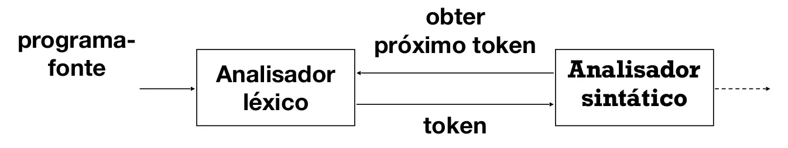

# Etapas (PT-BR)

## 1. Tradutor Simples

- Converter notação infixada para pós-fixada;
- Exemplo: `2 + 2 → 2 2 +`;
- Até o momento sem analisador léxico, pois os dígitos são os números naturais\*;
- Reconhecedor de uma gramática livre de contexto sem ambiguidades → `analisador sintático preditivo`;
- `Analisador sintático preditivo` "prevê" qual regra de produção da gramática será utilizada na estrutura da árvore sintática, lendo a entrada da esquerda para a direita;
- Ou seja, a gramática não pode ser `recursiva à esquerda`;

### 1.1 Gramática de Entrada (Notação Infixada)

- Primeiramente, expressões infixadas tipo `2 + 1 - 1` podem ser descritas pela GLC recursiva `à esquerda`:

```Java
expr →  expr + digit
        | expr - digit
        | digit
digit → 0 | .. | 9
```

- Equivalente à GLC recursiva `à direita`:

```Java
expr →  digit oper
oper →  + digit oper
        | - digit oper
        | ε
digit → 0 | .. | 9
```

### 1.2 Implementação do Parser

- PolishNotationParser.java

## 2. Analisador Léxico

- Os números serão representados por mais de um dígito;
- Possível através do `analisador léxico` (_scanner_):
  - Transforma um fluxo de caracteres em um fluxo de palavras na linguagem de entrada, para classificar as palavras gramaticalmente;
- O `analisador léxico` aplica a microssintaxe, que especifica como agrupar os caracteres em `palavras`;
- `Palavras` têm duas partes: lexema e categoria sintática. Exemplo: 'banana' tem o lexema 'banana' e a classe 'identificador' se `ID: [a-zA-Z_][a-zA-Z_0-9]*`;
- O `analisador léxico` (_scanner_) é subordinado ao **analisador sintático** (_parser_);


_Figura 1: Sempre que o analisador sintático (parser) precisa de palavras (tokens), o analisador léxico (scanner), que tem contato com os caracteres do programa de entrada, irá gerá-las. Sob demanda, nunca de uma vez [1]._

### 2.1 Implementação do Scanner

- Abordagem Adhoc: _Scanner_ será implementado com base em expressões regulares e outros métodos nativos do Java (Scanner.java)

## Referências

[1] SOUZA COSTA, S. **Tradução Dirigida por Sintaxe**. Disponível em: <https://profsergiocosta.notion.site/Tradu-o-dirigida-por-sintaxe-bc590c67d8234f81bee5cfdb505f2dd1?pvs=18>. Acesso em: 15 out. 2025.
